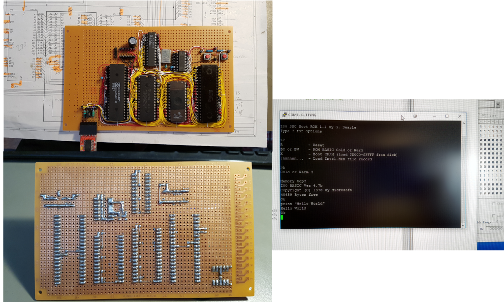

# Z80-Board
Z80 computer wirewrapped on perfboard

This Z80 board was inspired by Grant Searle's "9-chip" design - but using a GAL for most of the glue logic takes the chip count to 6! The plan was to build the board in three stages:

1) Get the system up and running with ROM BASIC only.

2) Wire up an 8-bit I/O port with controllable LEDs and sense/switch inputs.

3) Wire up a Compact flash-IDE adaptor to run CP/M from 'disk' and add an onboard 5V regulator & power socket.

The first pics show the board at stage 1.

For more details of what the board can do, and how to setup the compact flash card and CP/M, see Grant's original documentation:

http://searle.hostei.com/grant/cpm/index.html

In the early stages the board was powered via the USB-to-TTL serial adapter, drawing a current of about 170mA - which is probably pushing the poor thing a tad. My adapter often reset when plugged in; probably due to the inrush current. Substituting CMOS parts for the CPU and SIO will reduce supply current; using a CMOS Z80 brings the load down to 100mA.

If you use a discrete 5V supply for the board, remember to keep the GND/0V line of the USB-TTL adapter connected but disconnect its 5V line - do not try to use two power sources at the same time.

More pictures here: https://imgur.com/a/rGRR2NM

# Schematic

# Components

The core parts are:

* Mostek MK3880N-4 (4Mhz Z80 CPU - NMOS)
* Zilog Z80SIO/0 (Z8440AB1 - NMOS)
* TMS27C128-25 EPROM
* HM628128 1M (128Kx8) SRAM ('half-used' as in the original design)
* 74HCT00 Quad NAND gate - this MUST be an 74HCT part; the clock circuit is not likely to work with anything else (74LS, HC etc.)
* Lattice GAL20V8B-25LP - programmed using a TL866II device programmer/tester
* Each chip is decoupled by a 100nF ceramic capacitor
* Lots of male header pins for the wirewrapping
* IC sockets
* See the schematic for other miscellaneous parts

The GAL needs programming - I used the low-cost TL866 'universal programmer' (IMPORTANT: Untick 'Encrypt Ch' otherwise the GAL may not program correctly). The .JED file is ready to upload to the programmer. If you want to edit/change the source .PLD file, you will need a copy of WinCUPL (free from https://www.microchip.com/design-centers/programmable-logic/spld-cpld/tools/software/wincupl) or another CUPL editor.

Because 4Mhz parts were used, this board is fitted with a 3.6864Mhz crystal and the serial interface runs at 57,600BPS. If faster spec parts are used then the board should run at the original design clock speed of 7.3728Mhz, with a serial speed of 115,200BPS. You might get away with overclocking a 4Mhz Z80 CPU (YMMV), but the SIO chips are more fussy; a 6Mhz part is apparently OK at the faster speed, but a 4Mhz one is not likely to be happy. 

The I/O port comprises:

* 74HCT138 3-to-8 decoder
* 74LS245 TTL octal bus transceiver (hard wired for input only) 
* 74F374 octal D-type flip flop driving the LEDs (74LS or HCT374 would be fine)
* 6 x 1N4148 signal diodes as an address decoding OR gate
* 8 x green LEDs
* 8 x 390 ohm resistors
* 8 x 2K2 resistors
* 1 x 10K resistor
* 3 x 100nF ceramic decoupling capacitor

Other parts:

The CF-IDE adaptor (with 40-pin connector) was bought off eBay

The switching voltage regulator is a Murata OKI-78SR-5/1.5-W36-C. These units are pin compatible with the classic 7805 linear regulators, but can supply up to 1.5A without needing a heatsink.

There's a 15uF 35V tantalum decoupling capacitor on the input side of the regulator and a 100uF 16V one on the output.

### More Pictures

A view showing the decoupling caps (the ones for the 40-pin chips are under the sockets), a closeup of the wirewrapping, and then with the I/O port nearly done (74LS245 output port wiring missing); the I/O circuit is very similar to the digital I/O port of the RC2014 Z80 kit: https://rc2014.co.uk/modules/digital-io/

The final pics below show the board nearing completion: The CF card adaptor has been wired up together with the 5V switching regulator. The total current consumption with the CF card in place is 175mA with an 8V external supply. The board is now able to boot CP/M:

---

# Bonus Games

Modified to work on this platform and Microsoft Z80 BASIC Ver 4.7b (which boots from ROM)

SUPER STARTREK

The classic SUPER STARTREK from 1978. The main changes were to restrict line lengths and/or split long lines into multiples, re-writing the conditional statements accordingly, and to remove the print-formatting 'USING' command, which is not supported. 

The main program is STARTREK.BAS. TRKINST.BAS prints the instructions and in the original program was chain-loaded upon request,  but that feature has not been implemented so it's best to just read the source if you need guidance.

MAZE

Draws an ASCII maze (eventually, for big ones!)

BUNNY

ASCII bunny (well, 'Rabbit' now)

ELIZA

Early AI - Let Eliza sort out your troubles (not to be taken seriously)

---

All the above code loads via Tera Term using its copy-and-paste feature. 

Let me know if anything needs further modification...and enjoy some retro gaming!

