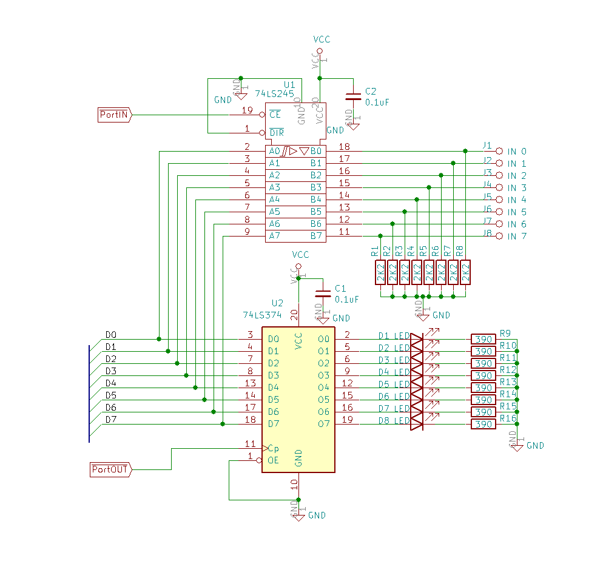
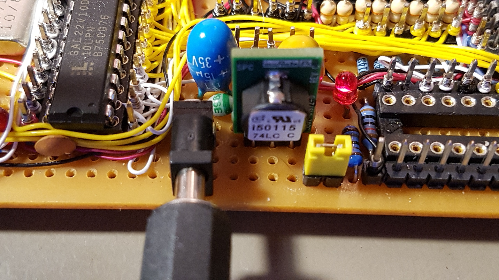
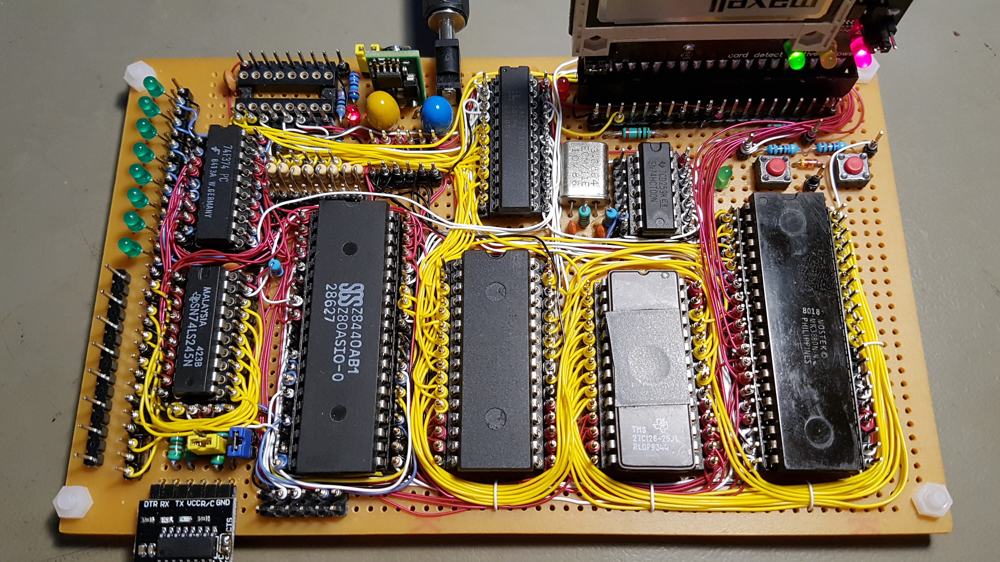
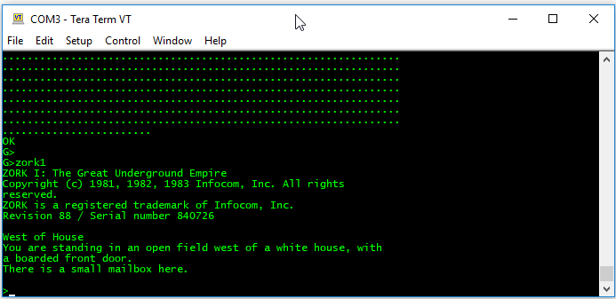
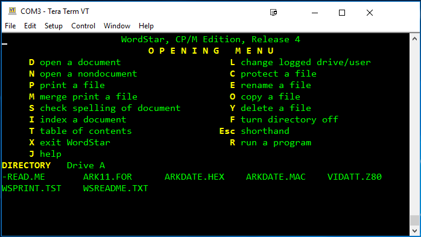
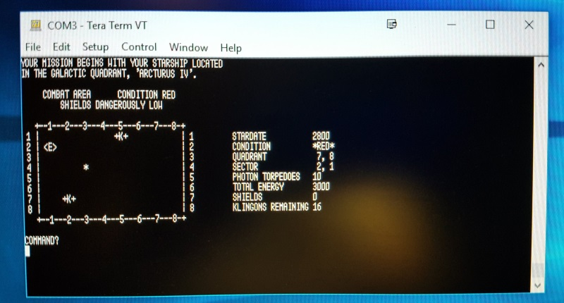

# Z80-Board
A Z80 computer wirewrapped on perfboard.

*This is a work in progress and details are being regularly updated.*

*03-Dec-2018:* This repo has been updated with a revised version of the board and associated files and images. The main changes from the original are:

* I/O port revised and chip select logic removed.
* GAL20V8 replaced with GAL22V10 to control the select signals for the I/O port.
* Changes to the signals and address lines routed through the GAL.
* M1 control signal added to CF/IDE select logic (wasn't used in Grant Searle's design).
* Second serial port wired up.
* SIO pin 18 jumper replaced with a direct connection to GND and the pin NOT wired to the header connector.

The wirewrapping technique uses standard IC sockets and PCB header pins, so the components and wiring are on the same side of the board; this has many benefits:

* It's easier to see what you are connecting together.
* It creates a very neat and compact layout. 
* Reworking is quicker and easier.
* No messy 'mat of wires' on the underside.
* Wirewrapping IC sockets are becoming expensive and harder to source. 

The construction technique can be seen in the photos: rows of header pins are placed alongside each IC socket and the two are solder-bridged on the copper side. Using perfboard, rather than stripboard, means there's no track cutting needed.

*These notes give a very generalised view of the board's construction; an experienced constructor will be able to follow along, however this is a personal build and there was never an intention to write-up full project construction notes for mass replication.*

This Z80 board was inspired by Grant Searle's "9-chip" design - but using a GAL for most of the glue logic takes the chip count to 6! The plan was to build the board in three stages:

1) Get the system up and running with ROM BASIC only.

2) Wire up an 8-bit I/O port with controllable LEDs and sense/switch inputs.

3) Wire up a Compact flash-IDE adaptor to run CP/M from 'disk' and add an onboard 5V regulator & power socket.

The first pics show the board at stage 1.

For more details of what the board can do, and how to setup the compact flash card and CP/M, see Grant's original documentation:

http://searle.hostei.com/grant/cpm/index.html

In the early stages the board was powered via the USB-to-TTL serial adapter, drawing a current of about 170mA - which is probably pushing the poor thing a tad. My adapter often reset when plugged in; probably due to the inrush current. Substituting CMOS parts for the CPU and SIO will reduce supply current; using a CMOS Z80 brings the load down to 100mA.

If you use a discrete 5V supply for the board, remember to keep the GND/0V line of the USB-TTL adapter connected but disconnect its 5V line - do not try to use two power sources at the same time.

IMPORTANT: Note that SIO pin 18 (CTSA) is grounded; PORT B won't function and you'll see no terminal prompt if the pin is left floating. 

More pictures here: https://imgur.com/a/rGRR2NM

# Schematic

# Components

The core parts are:

* Mostek MK3880N-4 (4Mhz Z80 CPU - NMOS)
* Zilog Z80SIO/0 (Z8440AB1 - NMOS)
* TMS27C128-25 EPROM
* HM628128 1M (128Kx8) SRAM (half-used, as in the original design)
* 74HCT00 quad NAND gate - see note below 
* Lattice GAL22V10D-10LP (original design used a 20V8) - programmed using a TL866II device programmer/tester
* Each chip is decoupled by a 100nF ceramic capacitor
* Lots of male header pins for the wirewrapping
* Indicator LEDs and resistors (see schematic)
* IC sockets
* See the schematic for other parts e.g.: the reset circuit, other resistors and connectors. 

NAND gate: This should be a 74HCT part (or can also be a 74AC if you are using a CMOS CPU and SIO). Other bipolar types (74LS, 74F etc.) won't oscillate.

The GAL needs programming - I used the low-cost TL866 'universal programmer' (IMPORTANT: Untick 'Encrypt Ch' otherwise the GAL may not program correctly). The .JED file is ready to upload to the programmer. If you want to edit/change the source .PLD file, you will need a copy of WinCUPL (free from https://www.microchip.com/design-centers/programmable-logic/spld-cpld/tools/software/wincupl) or another CUPL editor.

As of December 2018, the latest firmware for the TL866 and TL866 programmers will program a wider range of GALs. Also note that some of the earlier versions failed to program/verify the 20V8 parts properly, so it's worth checking your software/firmware version is up to date: http://autoelectric.cn/EN/TL866_main.html

Because 4MHz parts were used, this board is fitted with a 3.6864Mhz crystal and the serial interface runs at 57,600BPS. If faster spec parts are used then the board should run at the original design clock speed of 7.3728Mhz, with a serial speed of 115,200BPS. You might get away with overclocking a 4Mhz Z80 CPU (YMMV), but the SIO chips are more fussy; a 6Mhz part is apparently OK at the faster speed, but a 4Mhz one is not likely to be happy. 

# SIO chip

I used an SIO/0 chip because I had one to hand. Most Z80 retro designs use the SIO/2 and while either will work, they have subtle wiring differences and so are not plug compatible with each other. The main differences are related to the clock and serial port pins - check out Grant Searle's original schematic to understand how to wire up the circuit for an SIO/2: http://searle.hostei.com/grant/cpm/CPMSchematic1.2.gif

# I/O port

The  I/O port design comprises:

* 74LS245 TTL octal bus transceiver 
* 74F374 octal D-type flip flop driving the LEDs (74LS or HCT374 would be fine)
* 8 x green LEDs
* 8 x 390 ohm resistors
* 8 x 2K2 resistors
* 2 x 100nF ceramic decoupling capacitors.

The original I/O port design was very similar to the digital I/O port of the RC2014 Z80: https://rc2014.co.uk/modules/digital-io/, however, the mix of designs meant that there was an overlap at port address 0x00 between the SIO chip and the port. The updated schematic and GAL22V10 firmware keeps the SIO base at port 0x00 and moves the digital I/O port to 0x08.

# Other parts

### Compact Flash Adaptor

The CF-IDE adaptor (with 40-pin connector) was bought off eBay.

### Voltage regulator

The switching voltage regulator is a [Murata OKI-78SR-5/1.5-W36-C](https://power.murata.com/data/power/oki-78sr.pdf). These units are pin compatible with the classic 7805 linear regulators, but operate at around 90% efficiency and can supply up to 1.5A without needing a heatsink; saving precious board space as well as being energy efficient. The regulators are available from RS Components, Farnell/Element 14, Digikey and Mouser.

There's a 15uF 35V tantalum decoupling capacitor on the input side of the regulator and a 100uF 16V one on the output; these values are not too critical and low ESR electrolytics of around the same capacitance and voltage could be used. The voltage rating of the input capacitor allows for powering the board from a 19-20V laptop adaptor. The Murata regulator can take up to 36V  on its input, but if you decide to use anything close to that voltage, the input capacitor should be a 50V or 63V type. 

The diode in the voltage regulator input path was originally a 1A part (1N4001), whereas the Murata regulator can supply up to 1.5A (although it limits short circuit current to 10mA); in effect, the diode was used as a safety fuse as well as for polarity protection. Later, the diode was replaced with a 3A part eg: 1N54xx. 

If you do use a 7805 linear regulator it will likely need a suitable heatsink, especially if using a supply voltage above 9V. The decoupling capacitor requirements are also different from the Murata part, so check the data sheet. 7805 linear regulators have a short circuit current limit of around 250-400mA, depending on manufacturer and exact model; this will be enough to damage parts or make things get hot under fault conditions, so you may want to fit a suitable (1A) fuse or polyfuse if you think your board's going to be treated roughly.

Due to the dropout voltage of the regulator (switched or linear), plus the protection diode drop, the minimum board input voltage is around 8-9V. The total current consumption with the CF card in place is 175mA @ 8V, rising to around 230mA with the I/O port fitted.  

### USB-Serial adaptor notes

The resistors between the USB-Serial adaptor and the SIO chip reduce the risk of damaging something if the handshake and signal pins are connected but there's no power to the board. Grant's board used 2K7 resistors and this one originally had 1K parts; those worked fine with an FTDI (probably clone) adaptor (left in picture), but the value had to be reduced to 510R for a CH340G-based one (right in picture) to make the port work.

### More Pictures

A view showing the decoupling caps (the ones for the 40-pin chips are under the sockets), a closeup of the wirewrapping, and then with the I/O port nearly done (LEDs working fine, but 74LS245 input port wiring missing).

Finally (below), here's the nearly-complete board. The I/O port chips are now controlled by the GAL22V10 and so the LS138 address decoder (empty socket at the top of the board) is not needed - I am going to remove the socket and unneeded components and use the space for two 8-bit headers: One to repeat the output (LEDs) port and one for the main data bus. I also plan to put a header to the right of the CPU for the address bus and main timing signals so that I have a full set of pins for a logic analyzer. The other header at the bottom of the board is for the second serial port on the SIO/0 chip. 

---
## Application Software

.

---

# Bonus Programs

BUNNY

ASCII bunny (well, 'Rabbit' now)

ELIZA

Early AI - Let Eliza sort out your troubles (not to be taken seriously)

MAZE

Draws an ASCII maze (eventually, for big ones!)

NKLED2/NKLED3

*** See the porter.com program below ***
If you implement the simple I/O port, these programs control the LEDs. Written for Turbo Pascal 3 on CP/M. Compiled program and source code provided. 

Note that NKLED3 was created from NKLED2 on an RC2014-type Z80 system (https://rc2014.co.uk/), so its default port address is 0, as opposed to 8 for the board described here. As the source is provided, the default can easily be changed if you don't fancy entering it on the command line.

PORTER

This is a much-expanded version of the LED programs mentioned above. This program can write to a defined I/O port OR to port A or B on a Z80 PIO chip for general port testing or sending patterns to connected LEDs. The program has an interactive menu or can be full driven from the command line. Supplied as both a .com file and the Turbo pascal source code.

SNAKEnnn.COM

This is a snake/maze game. The original source code was written by Karl A. Brokstad (www.Z80.no) and used with permission. This is a work in progress so don't expect perfection!

SUPER STARTREK

Modified to work on Microsoft Z80 BASIC Ver 4.7b (which boots from ROM). The classic SUPER STARTREK from 1978. The main changes were to restrict line lengths and/or split long lines into multiples, re-writing the conditional statements accordingly, and to remove the print-formatting 'USING' command, which is not supported. 

If you are after a version that runs on mbasic on CP/M, see: https://github.com/RC2014Z80/RC2014/blob/master/BASIC-Programs/Super%20Startrek/startrek.bas

The main program is STARTREK.BAS. TRKINST.BAS prints the instructions and in the original program was chain-loaded upon request,  but that feature has not been implemented so it's best to just read the source if you need guidance.

---

All the above code loads via Tera Term using its copy-and-paste feature (MS Basic in BIOS) or by using Grant Searle's file uploader for CP/M: http://searle.hostei.com/grant/cpm/index.html#InstallingApplications 

Let me know if anything needs further modification...and enjoy some retro computing!

